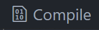
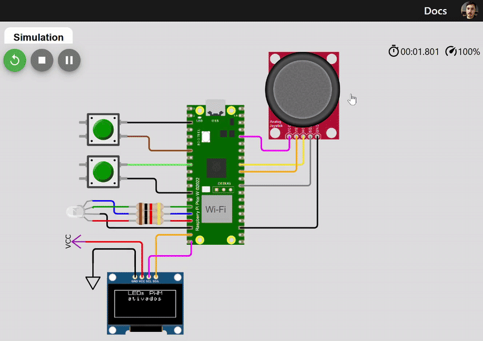
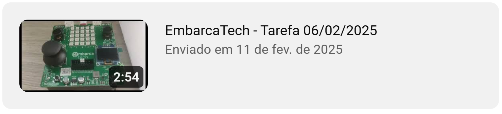

<h1 align="center">Embarcatec | Tarefa Aula Sincrona 10/02/2025</h1>

<div align="center">  
  
</div>

## Objetivo do Projeto

Com o emprego do módulo PWM (Pulse Width Modulation) e do ADC (Analog to Digital Converter), presentes no microcontrolador RP2040 da Raspberry Pi Pico W, foi projetado um sistema com a ferramenta Pico SDK para, usando um joystick através do ADC, controlar a intensidade de um LED usando PWM e representar a posição do joystick no display SSD1306.


## 🗒️ Lista de requisitos

- Cabo USB
- Placa Bitdoglab ou os itens abaixo:
    - Protoboard;
    - Joystick Analógico (Plugin 13x13mm Multi-Dir ROHS);
    - Display OLED ssd1306 (0.96 polegadas I2C 128x64 oled display);
    - 3 Resistores de 1kΩ;
    - 1 LED RGB;
    - Fios e jumpers; 
    - Microcontrolador Raspberry Pi Pico W; 

## 🛠 Tecnologias

1. **Git e Github**;
2. **VScode**;
3. **Linguagem C**;
4. **Extensões no VScode do Raspberry Pi Pico Project e CMake**

## 💻 Instruções para Importar, Compilar e Rodar o Código Localmente

Siga os passos abaixo para clonar o repositório, importar no VS Code usando a extensão do **Raspberry Pi Pico Project**, compilar e executar o código.

1. **Clone o repositório para sua máquina local**  
   Abra o terminal e execute os comandos abaixo:
   ```bash
   git clone https://github.com/alexsami-lopes/EmbarcaTech-Tarefa-Aula-Sincrona-10-02-2025.git
   cd EmbarcaTech-Tarefa-Aula-Sincrona-10-02-2025

2. **Abra o VS Code e instale a extensão "Raspberry Pi Pico Project" (caso não já a tenha instalada)**
 - No VS Code, vá até "Extensões" (Ctrl+Shift+X)
 - Pesquise por "Raspberry Pi Pico Project"
 - Instale a extensão oficial

3. **Importe o projeto no VS Code**
 - No VS Code, na barra lateral do lado esquerdo clique em "Raspberry Pi Pico Project" 
 - No menu que aparecer clique em 
 - Clicando em "Change" escolha a pasta clonada do repositório
 - Escolha a versão do SDK 2.1.0
 - Clique em "Import"


    


4. **Compile o projeto**
 - Com o projeto aberto no VS Code, pressione 
 - Aguarde a finalização do processo de build

5. **Rode o código no Raspberry Pi Pico**
 - Conecte o Raspberry Pi Pico ao PC segurando o botão "BOOTSEL".
 - Arraste e solte o arquivo `.uf2`, localizado dentro da pasta "build" do seu projeto, gerado na unidade USB montada.
 - O código será carregado automaticamente e o Pico será reiniciado.
 - Caso tenha instalado o driver com o Zadig clique em "Run" ao lado do botão 


## 🔧 Funcionalidades Implementadas:

O joystick fornece valores analógicos correspondentes aos eixos X e Y, que são utilizados para controlar a intensidade luminosa dos LEDs RGB, onde:
1. O LED Azul tem seu brilho ajustado conforme o valor do eixo Y. Quando o joystick está solto (posição central), o LED permanece apagado. À medida que o joystick for movido para cima (valores menores) ou para baixo (valores maiores), o LED aumenta seu brilho gradualmente, atingindo a intensidade máxima nos extremos (0 e 4095).
2. O LED Vermelho segue o mesmo princípio, mas de acordo com o eixo X. Quando o joystick está solto (posição central), o LED está apagado. Movendo o joystick para a esquerda (valores menores) ou para a direita (valores maiores), o LED aumenta de brilho, sendo mais intenso nos extremos (0 e 4095).
3. Os LEDs são controlados via PWM para permitir variação suave da intensidade luminosa.
É exibido no display SSD1306 um quadrado de 8x8 pixels, inicialmente centralizado, que se move proporcionalmente aos valores capturados pelo joystick.
Adicionalmente, o botão do joystick tem as seguintes funcionalidades:
4. Alterna o estado do LED Verde a cada acionamento.
5. Modifica a borda do display para indicar quando foi pressionado, alternando entre diferentes estilos de borda a cada novo acionamento.
Finalmente, o botão A tem a seguinte funcionalidade:
   - Ativar ou desativar os LED PWM a cada acionamento.

## 💻 Desenvolvedor
 
<table>
  <tr>

<td align="center"><br /><sub><b> Alexsami Lopes </b></sub></a><br />👨‍💻</a></td>

  </tr>
</table>


## 🎥 Demonstração no Wokwi: 

<div align="center">
  <figure>  
    
    
<figcaption>

**Figura 1** - Demo **(acelerada)** do Projeto no Wokwi.com - Acessível em: https://wokwi.com/projects/423200576915385345
    </figcaption>
  </figure>
</div>


## 🎥 Demonstração na Placa (Video): 

<div align="center">
  <a href="https://youtu.be/MkjJTz6ifls" target="_blank">
    
  </a>
</div>
